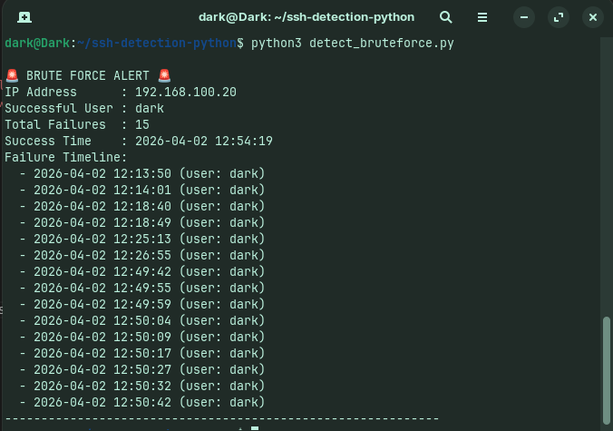

# 🔐 SSH Brute Force Detection using Python

## 🚨 Project Overview

This project detects SSH brute-force attacks by analyzing Linux authentication logs.
It identifies suspicious patterns where multiple failed login attempts are followed by a successful login from the same IP address — indicating a potential compromise.

---

## 🎯 Objective

Detect attack pattern:
FAILED → FAILED → FAILED → SUCCESS

This pattern is commonly observed in brute-force attacks where an attacker eventually gains access after multiple failed attempts.

---

## ⚔️ Attack Simulation

* **Attacker:** Host machine
* **Target:** Ubuntu Virtual Machine
* **Method:** Multiple SSH login attempts using incorrect passwords
* **Result:** Successful login after repeated failures

Logs were generated in:

```bash
/var/log/auth.log
```

---

## 🏗️ Architecture

```text
Attacker → SSH → Victim VM → auth.log → Python Script → Detection Alert
```

---

## ⚙️ How It Works

* Parses SSH logs (`auth.log`)
* Extracts:

  * Failed login attempts
  * Successful login attempts
* Tracks activity per IP address
* Triggers alert when:

  * ≥ 3 failed attempts
  * Followed by a successful login

---

## 🚨 Sample Output



---

## 🛠️ Technologies Used

* Python
* Regular Expressions (Regex)
* Linux (SSH logs)
* VirtualBox (lab environment)

---

## 📂 Project Structure

```text
ssh-brute-force-detection-python/
│── detect_bruteforce.py
│── ssh_logs.txt
│── screenshots/
│   └── output.png
│── README.md
```

---

## 🧠 Key Concepts Demonstrated

* Log analysis
* Event correlation
* Threat detection logic
* Security monitoring
* Basic incident investigation

---

## 🔥 Why This Project Matters

SSH brute-force attacks are one of the most common attack vectors in real-world environments.
This project demonstrates how security analysts detect such attacks using log data and correlation techniques similar to SIEM tools.

---

## 🚀 Future Improvements

* Export alerts to CSV/JSON
* Add severity classification
* Real-time monitoring (live log analysis)
* Integration with SIEM tools

---

## 👨‍💻 Author

Cybersecurity Enthusiast | SOC Analyst Learner
